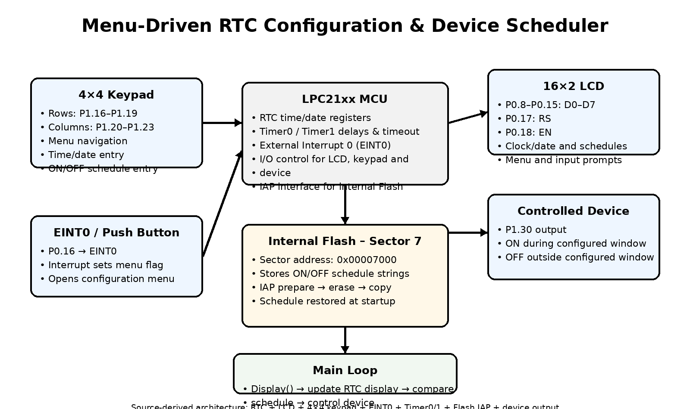

# ⏰ Menu-Driven RTC Configuration & Device Scheduler

<p align="center">


</p>

---

# 📖 Table of Contents

- 📌 Project Overview
- 🎯 Objectives
- 🖼 Block Diagram
- 🏗 System Architecture
- ⚙ Hardware Requirements
- 💻 Software Requirements
- 📂 Repository Structure
- 🔢 Keypad Menu Map
- 🚀 Features
- 🖥 LCD Output Gallery
- ▶ Build Instructions
- 📈 Future Enhancements
- 👨‍💻 Author

<br>

---

# 📌 Project Overview

This project implements a **standalone real-time clock and device scheduler** on an **LPC21xx ARM7** microcontroller.

A hardware **RTC** maintains time and date, a **16×2 LCD** displays the clock, date and device status, and a **4×4 keypad** drives an on-screen configuration menu. Pressing an external button wired to **EINT0** opens the menu, where the user can set the time/date and configure an **ON/OFF schedule** for an external device driven on `P1.30`.

The configured schedule is saved to **internal Flash via IAP**, so it survives a power cycle and is automatically restored and re-applied on every startup.

<br>

---

# 🎯 Objectives

- Real-time clock and date keeping
- Keypad-driven configuration menu
- Time/date editing
- Device ON/OFF schedule editing
- External-interrupt based menu entry
- Non-blocking menu/input timeout handling
- Persistent schedule storage in internal Flash
- Automatic schedule restore after reset/power loss

<br>

---

# 🖼 Block Diagram

<p align="center">
    
</p>

<br>

---

# ⭐ Overnight Schedule Handling

One of the key pieces of logic in this project is **midnight-crossing schedule comparison**.

Rather than only supporting a same-day ON→OFF window, `Display()` detects whether the configured OFF time is earlier than the ON time and, if so, treats the schedule as spanning midnight.

- **Normal range** (`ON time < OFF time`) → device is ON while `ON time ≤ current time < OFF time`
- **Overnight range** (`ON time > OFF time`) → device is ON while `current time ≥ ON time` **or** `current time < OFF time`

This means a schedule like `ON 22:00 → OFF 06:00` correctly keeps the device active across midnight without any special-casing by the user.

---

### RTC / Schedule Comparison Workflow ⚠️

```text
        🚀 Display() tick
             │
             ▼
     🕐 Read current RTC time
             │
             ▼
   🔍 Compare vs ON / OFF schedule
             │
      ┌──────┴───────┐
      │               │
      ▼               ▼
 ON < OFF          ON > OFF
(Normal range)   (Overnight range)
      │               │
      ▼               ▼
 time in [ON,OFF) ?  time≥ON OR time<OFF ?
      │               │
      └──────┬────────┘
             ▼
     📟 Drive P1.30 output
             │
             ▼
     🔁 Repeat every tick
```

---

### Advantages

- Correct behavior for both daytime and overnight schedules
- No manual "next day" handling required from the user
- Continuous, non-blocking evaluation inside the main display loop

<br>

---

# 🏗 System Architecture

| Module | Function |
|--------|----------|
| ⚙️ LPC21xx MCU | Main controller |
| 🕐 Hardware RTC | Maintains time/date |
| 🖥 16×2 LCD | Displays clock, date, schedules and menus |
| 🔢 4×4 Keypad | Menu navigation and numeric input |
| 🔔 EINT0 | Opens the configuration menu via external interrupt |
| ⏱ Timer0 | Millisecond delay generation |
| ⏱ Timer1 | Menu/input timeout handling |
| 💾 Internal Flash (IAP) | Stores the ON/OFF schedule |
| 🔌 P1.30 | Controlled device output |

<br>

---

# ⚙ Hardware Requirements

| Hardware | Quantity | Purpose |
|----------|---------:|---------|
| LPC21xx MCU | 1 | Controller |
| 16×2 Character LCD | 1 | Time / date / menu display |
| 4×4 Matrix Keypad | 1 | Menu navigation and numeric input |
| Push Button | 1 | EINT0 menu-entry trigger |
| Relay / Device Driver | 1 | Switches the scheduled load via P1.30 |
| Crystal Oscillator (12 MHz) | 1 | System clock source |

<br>

---

# 💻 Software Requirements

| Software | Purpose |
|----------|---------|
| Keil uVision | Development |
| Embedded C | Programming |
| Flash Magic | Programming LPC21xx over ISP |
| Proteus | Simulation |
| Git | Version Control |

<br>

---

# 📂 Repository Structure

```text
MENU-DRIVEN-RTC-CONFIGURATION
│
├── src
│   └── MENU-DRIVEN RTC CONFIGURATION.c
│
├── images
│   └── rtc-scheduler-block-diagram.png
│
├── docs
│   └── project-notes.md
│
├── README.md
└── LICENSE
```

<br>

---

# 🔢 Keypad Menu Map

**Main menu**

```text
1. EDIT-TIME
2. E_dev_T_she
3. EXIT
```

**Time / Date menu**

```text
1. SET HH   00-23
2. SET MM   00-59
3. SET DAY  0-6
4. SET DOM  01-31
5. SET MON  01-12
6. SET YEAR
7. EXIT
```

**Device schedule menu**

```text
1. ON HH  00-23
2. ON MM  00-59
3. OF HH  00-23
4. OF MM  00-59
5. EXIT
```

Every numeric entry is checked against its stated min/max range before being accepted.

<br>

---

# 🧩 Important Source Functions

| Function | Purpose |
|----------|---------|
| `INIT()` | Initializes GPIO, timers, EINT0, LCD, RTC, CGRAM |
| `rtc_init()` | Configures and starts the RTC |
| `LCD_INIT()` | Initializes the LCD (8-bit, 2-line mode) |
| `key_scan()` | Reads keypad input |
| `INT0_CONF()` | Configures EINT0 |
| `INT_BUTTEN()` | EINT0 interrupt service routine |
| `Flage_call()` | Opens the main configuration menu |
| `Edit_Time()` | Edits time/date fields |
| `Edit_Sehd()` | Edits ON/OFF schedule fields |
| `Display()` | Refreshes LCD and drives schedule-based output control |
| `Upload_shed()` | Saves the schedule to Flash (IAP) |
| `Update_Shed()` | Loads the schedule from Flash on startup |

<br>

---

# 🚀 Features

- ✅ LPC21xx embedded C firmware (ARM7)
- ✅ Hardware RTC with time/date keeping
- ✅ 16×2 LCD user interface
- ✅ 4×4 keypad menu navigation
- ✅ External-interrupt-based menu entry (EINT0) ⭐
- ✅ Time and date configuration
- ✅ ON/OFF device scheduling
- ✅ Overnight (midnight-crossing) schedule handling
- ✅ Timer-based menu/input timeout
- ✅ Internal Flash (IAP) schedule storage
- ✅ Automatic schedule restore after reset/power loss
- ✅ Day-of-week display
- ✅ Range-checked numeric input

<br>

---

# 🖥 LCD Output Gallery

> 📸 Add photos or Proteus screenshots of your own LCD output below — replace the placeholder image paths with files under `images/`.

<table align="center">

<tr>
<th align="center">🕐 Clock &amp; Date Display</th>
<th align="center">📋 Main Menu</th>
</tr>

<tr>
<td align="center">

</td>

<td align="center">

</td>
</tr>

<tr>
<th align="center">🛠 Time/Date Edit Menu</th>
<th align="center">🔌 Schedule Edit Menu</th>
</tr>

<tr>
<td align="center">

</td>

<td align="center">

</td>
</tr>

<tr>
<th colspan="2" align="center">⚠️ Range-Error Message</th>
</tr>

<tr>
<td colspan="2" align="center">

<br>
<b>Invalid Input Warning Screen</b>
</td>
</tr>

</table>

<br>

---

# 🔄 Main Program Flow

```text
        🚀 START
             │
             ▼
     ⚙️ INIT()  (GPIO / Timers / EINT0 / LCD / RTC / CGRAM)
             │
             ▼
     🗓 DATE()  (update display)
             │
             ▼
     💾 Update_Shed()  (load Flash data)
             │
             ▼
     🖥 Display()  (RTC + LCD + schedule control)  ◄──────────┐
             │                                                │
             ▼                                                │
       flage == 1 ? ──── No ─────────────────────────────────┘
             │
            Yes
             ▼
     🔔 Flage_call()  (Configuration Menu)
             │
             ▼
      🔁 Return to loop
```

---

# ▶ Build Instructions

1. Open the project in Keil uVision.
2. Select the exact LPC21xx part number used on your board and add the matching device header/startup files.
3. Build the project.
4. Flash the target using Flash Magic over UART/ISP.
5. Wire up the LCD, keypad, EINT0 button, and the device output (`P1.30`) per the hardware requirements.
6. Power ON, set the time/date and schedule via the keypad menu, and observe LCD and schedule output.

<br>

---

# 📈 Future Enhancements

- Multiple independent ON/OFF schedules (weekday-based)
- Battery-backed RTC failure detection / re-sync
- UART/Bluetooth remote configuration
- Manual override button independent of the schedule
- RTC alarm interrupt instead of polled comparison

<br>

---

# 👨‍💻 Author

**Menu-Driven RTC Configuration & Device Scheduler**

Embedded Systems | Embedded C | ARM7 | RTC | LCD | Keypad | Flash IAP
